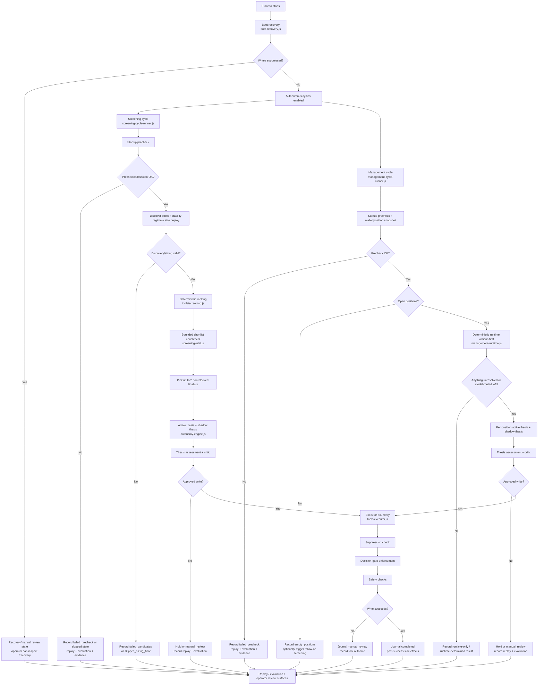
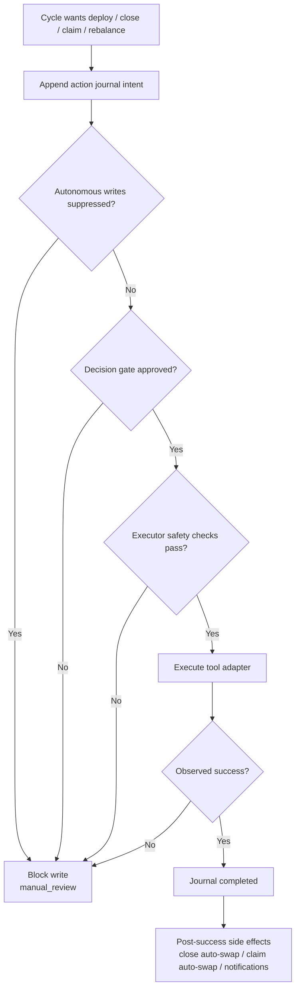

# Autonomous Workflow Diagram

Date: `2026-03-30`
Status: current runtime flow

## Goal

Explain how Zenith currently moves from startup to screening, management, gated writes, recovery, and operator review without hand-wavy agent mythology.

## Primary Flow

## Write Boundary

## Workflow Stages

- **Boot and recovery** — `boot-recovery.js` folds the action journal, observes open positions, and suppresses autonomous writes if prior workflows are ambiguous or the journal is corrupt.
- **Screening** — `screening-cycle-runner.js` fails closed on startup/admission/provider issues, ranks pools deterministically, enriches only the bounded shortlist, backfills around hard-blocked candidates, then runs active plus best-effort shadow theses before any write can happen.
- **Management** — `management-cycle-runner.js` loads current positions, lets `management-runtime.js` resolve obvious stop-loss / take-profit / rebalance / fee actions first, then sends only unresolved positions through the thesis + critic path.
- **Assessment and critic** — `decision-thesis.js` rejects weak, stale, or contradictory theses, and `decision-critic.js` adds kill-pass logic for conflict, stale signals, deploy loss clusters, and memory vetoes.
- **Executor boundary** — `tools/executor.js` is the real blast wall: it requires an approved decision gate, performs safety checks, journals `intent -> completed/manual_review`, and only then allows side effects.

## Screening Intelligence Gates

- Deterministic rank happens before model reasoning in `tools/screening.js`.
- Shortlist enrichment in `screening-intel.js` adds holder intel, address blacklist checks, creator/deployer denylist checks, bounded public OKX market intel, LP-wallet scoring, and narrative context.
- Finalists hard-block on signals like blacklisted holder/funding addresses, blocked creators, honeypot tags, excessive OKX bundle concentration, and unavailable critical holder / OKX advanced intel.
- If an enriched top candidate hard-blocks, Zenith backfills the finalist window from the shortlist before thesis generation instead of letting one blocked candidate poison the whole window.

## Management Runtime Split

- Deterministic runtime actions run first so the model does not waste turns on obvious work.
- Runtime actions still flow through the runtime thesis + critic path before hitting the executor boundary.
- Blocked or errored runtime actions are allowed to escalate into model-managed review instead of being silently treated as handled.
- Management status now distinguishes real outcomes like `runtime_only`, `held`, `manual_review`, and `failed_write` instead of over-reporting success.

## Recovery, Replay, and Review

- `action-journal.js` keeps append-only write workflow state for restart safety and operator review.
- `cycle-trace.js` writes replay envelopes for screening and management cycles.
- `cycle-replay.js` and `replay-review.js` re-run deterministic logic over recorded envelopes so operators can compare what happened against what the runtime should have done.
- `state-evaluation.js` and `state.js` persist recent cycle summaries, tool outcomes, and counters for screening, management, theses, critic decisions, shadow divergence, and write outcomes.
- `/evaluation`, `/review`, `/recovery`, `/journal`, `/replay`, and `/reconcile` expose those surfaces without requiring raw file inspection.

## Failure and Review Paths

- Startup/provider failures fail closed before the model is invoked.
- Screening discovery/provider issues now report `failed_candidates` instead of masquerading as an empty market.
- Approved-write execution failures report `failed_write` instead of looking like successful autonomous progress.
- Shadow inference is observational only: if it fails, active decisions still continue, but review quality drops for that cycle.
- `claim_fees` and `close_position` now both rely on bounded settlement observation rather than trusting immediate post-transaction balance reads.

## Source Map

- `boot-recovery.js`
- `action-journal.js`
- `screening-cycle-runner.js`
- `management-cycle-runner.js`
- `management-runtime.js`
- `autonomy-engine.js`
- `decision-thesis.js`
- `decision-critic.js`
- `screening-intel.js`
- `tools/screening.js`
- `tools/executor.js`
- `cycle-trace.js`
- `cycle-replay.js`
- `replay-review.js`
- `state-evaluation.js`
